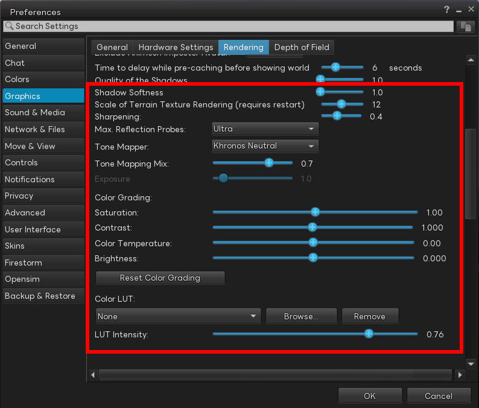
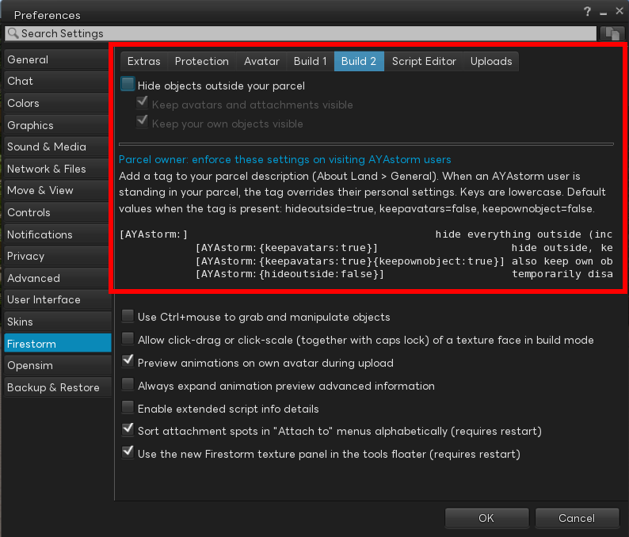
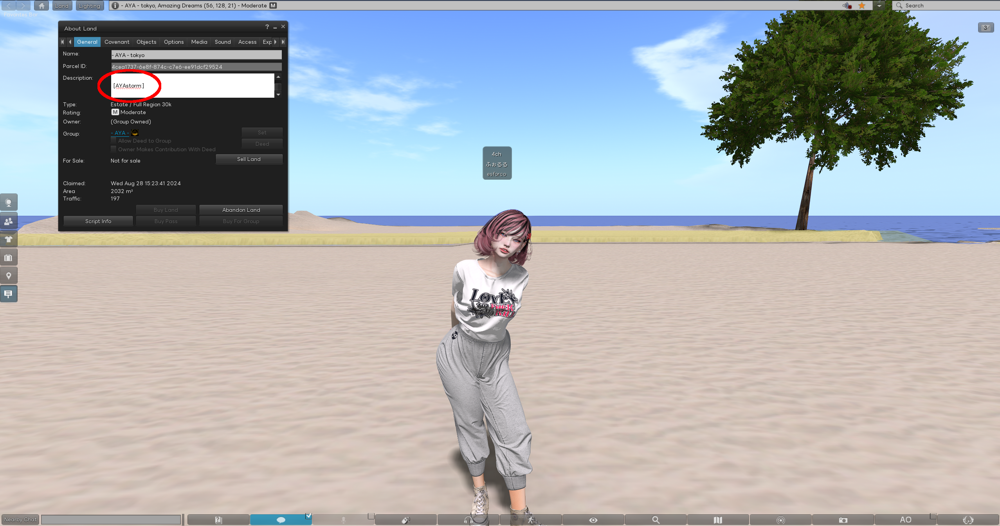
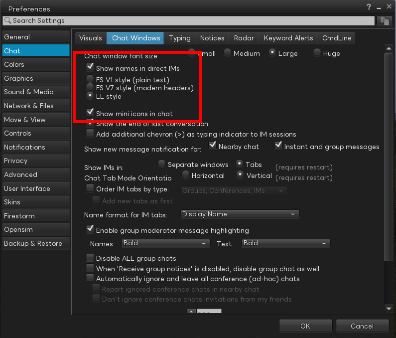
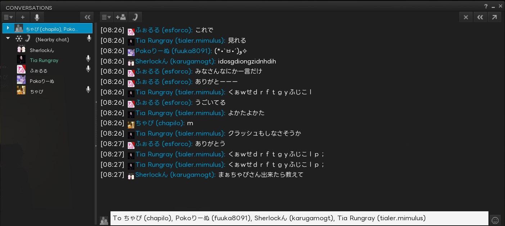

[](https://github.com/mayatonton/phoenix-firestorm/releases/latest)


**AYAstorm は [Firestorm](https://www.firestormviewer.org) をベースにした、Second Life 向けカスタム Viewer です。**
レンダリング拡張・UI 改善・日本語対応などを独自に追加しています。

**AYAstorm is a custom Second Life viewer based on [Firestorm](https://www.firestormviewer.org), with enhancements for rendering, UI, and Japanese language support.**

**AYAstorm 是基于 [Firestorm](https://www.firestormviewer.org) 的定制 Second Life 客户端，在渲染增强、界面改进和日语支持方面有独特改进。**

---

## 機能 / Features / 功能

### レンダリング / Rendering / 渲染

環境設定 → グラフィック → レンダリング タブから設定できます。
**Configurable from Preferences → Graphics → Rendering tab.**
**可在 设置 → 图形 → 渲染 标签页中配置。**



- **Shadow Softness（影の柔らかさ）** — 影のエッジを柔らかくする調整スライダーを追加
  **Shadow Softness** — New slider to soften shadow edges
  **阴影柔和度** — 新增滑块用于柔化阴影边缘

- **トーンマッパー選択肢を拡張** — 既存の Firestorm では内部的に Khronos Neutral 固定だったトーンマッパーを、UI から以下5種類から選択可能に:
  - Khronos Neutral / ACES / Filmic (Uncharted 2) / Uchimura (GT) / Filmic (BD Style)

  **Selectable Tone Mappers** — Upstream Firestorm hard-codes Khronos Neutral internally; AYAstorm exposes a UI selector with five options:
  - Khronos Neutral / ACES / Filmic (Uncharted 2) / Uchimura (GT) / Filmic (BD Style)

  **可选色调映射器** — 上游 Firestorm 在内部固定为 Khronos Neutral，AYAstorm 在界面上提供五种选择：
  - Khronos Neutral / ACES / Filmic (Uncharted 2) / Uchimura (GT) / Filmic (BD Style)

- **Color Grading コントロール** — Saturation（彩度）／ Contrast（コントラスト）／ Color Temperature（色温度）／ Brightness（明度）の4つを UI から調整可能に。`Reset Color Grading` ボタンで一括リセットできます
  **Color Grading Controls** — Adjustable Saturation, Contrast, Color Temperature, and Brightness sliders (with a `Reset Color Grading` button) added to the UI
  **色彩分级控制** — 在界面上添加了饱和度 / 对比度 / 色温 / 亮度四项滑块，并提供 `Reset Color Grading` 一键重置按钮

- **Color LUT (.cube) 読み込み** — ポストプロセスで `.cube` 形式の 3D LUT を適用してカラーグレーディングが可能。標準で7種のプリセット (`teal_orange` / `warm` / `cold_war` / `sepia` / `cool` / `cinematic` / `film_noir`) を同梱していますが、本来の狙いは **ユーザー自身が任意の `.cube` ファイルを読み込んで描画の風合いを自由に変更できること** です。`Browse...` から好みの LUT を指定し、`LUT Intensity` で適用強度を調整できます
  **Color LUT (.cube) Loading** — Apply 3D LUT files (`.cube`) for post-process color grading. Seven presets are bundled (`teal_orange`, `warm`, `cold_war`, `sepia`, `cool`, `cinematic`, `film_noir`), but the primary goal is to let **users load their own `.cube` files to fully customize the look of the viewer**. Pick a LUT via `Browse...` and adjust `LUT Intensity` to taste
  **Color LUT (.cube) 加载** — 通过后处理应用 `.cube` 格式的 3D LUT 进行色彩分级。内置七种预设 (`teal_orange` / `warm` / `cold_war` / `sepia` / `cool` / `cinematic` / `film_noir`)，但核心目的是 **让用户加载自己的 `.cube` 文件，自由定制画面风格**。通过 `Browse...` 选择 LUT，并使用 `LUT Intensity` 调整应用强度

### 区画 / Parcel / 区域

環境設定 → Firestorm → Build 2 タブから設定できます。
**Configurable from Preferences → Firestorm → Build 2 tab.**
**可在 设置 → Firestorm → Build 2 标签页中配置。**



#### 利用者側 — 区画外オブジェクトを非表示 / Hide objects outside parcel / 隐藏区域外物体

- **`Hide objects outside your parcel`** — 自分が今立っている区画の外にあるオブジェクトを描画しない設定。**任意の区画で有効**で、撮影時に背景の邪魔なプリムや看板を一時的に消したいとき等に使えます。アバター・添付物・HUD・自分の所有物は除外オプションで残せます (`Keep avatars visible` / `Keep my own objects visible`)
  **`Hide objects outside your parcel`** — Don't render objects outside the parcel you're currently standing on. Works on **any parcel** — handy when taking screenshots and you want to clear away neighbouring prims or signs from the background. Avatars / attachments / HUDs / your own objects can be kept visible via `Keep avatars visible` / `Keep my own objects visible`
  **`Hide objects outside your parcel`** — 不渲染当前所站区域之外的物体。**在任意区域均可启用** —— 拍摄截图时想清理掉相邻地块上碍眼的物件或招牌时非常有用。可通过 `Keep avatars visible` / `Keep my own objects visible` 保留头像 / 附件 / HUD / 自有物体

#### 区画オーナー側 — description タグによる強制 / Parcel-owner forced hiding via description tag / 区域所有者通过描述标签强制启用

区画 (Parcel) の **description (説明文) に下記タグを書き込む**だけで、その区画を訪れた **AYAstorm 利用者** に対して上記の隠し動作を強制発動できます。**他の Viewer (本家 Firestorm / 公式 LL Viewer 等) はこのタグを解釈しないため影響を受けません** — つまり「AYAstorm ユーザーにだけ効くプライバシー保護タグ」として機能します。区画オーナー権限で書ける箇所なので、訪問者側の合意も設定変更も不要です。

Just write the tag below into the **parcel description** and any **AYAstorm visitor** to that parcel will have the hide-outside behaviour forced on. **Other viewers (upstream Firestorm, official LL viewer, etc.) ignore the tag entirely**, so it functions as a "privacy tag that only affects AYAstorm users". As parcel owner you can set it without any cooperation from visitors.

只需在 **区域 (Parcel) 的描述文本中** 写入下方标签，所有访问该区域的 **AYAstorm 用户** 都会被强制启用上述隐藏行为。**其他 Viewer (上游 Firestorm / 官方 LL Viewer 等) 不会解析此标签，因此完全不受影响** —— 也就是说，它是一个 "仅对 AYAstorm 用户生效的隐私保护标签"。区域所有者无需访问者配合即可设置。

**タグ書式 / Tag format / 标签格式:**

```
[AYAstorm:{key:value}{key:value}...]
```

- description のどこに書いても OK (前後に他の文章があっても可)
- Can appear anywhere in the description (other text before/after is fine)
- 可写在描述的任何位置（前后可有其他文本）

| キー / Key | デフォルト / Default | 動作 / Behaviour / 行为 |
|---|---|---|
| `hideoutside` | `true` | `false` でタグを一時無効化 / `false` temporarily disables the tag / `false` 临时禁用此标签 |
| `keepavatars` | `false` | `true` でアバター・HUD は表示 / `true` keeps avatars & HUDs visible / `true` 保留头像与 HUD |
| `keepownobject` | `false` | `true` で訪問者自身の所有物は表示 / `true` keeps the visitor's own objects visible / `true` 保留访问者自有物体 |

**例 / Examples / 示例:**

| description に書く文字列 | 効果 / Effect / 效果 |
|---|---|
| `[AYAstorm:]` | 区画外を全部隠す (アバターも自分の物も隠す) / Hide everything outside the parcel / 隐藏区域外的所有内容 |
| `[AYAstorm:{keepavatars:true}]` | アバターは見えるが他の物は隠す / Avatars stay visible, other objects hidden / 保留头像，其他物体隐藏 |
| `[AYAstorm:{keepavatars:true}{keepownobject:true}]` | 一般的に使いやすい設定 / Common-sense default / 通用推荐设置 |
| `[AYAstorm:{hideoutside:false}]` | タグ一時無効 (イベント時など) / Temporarily disable tag (during events etc.) / 临时禁用 (例如举办活动时) |

**効果イメージ / Effect comparison / 效果对比:**

<table>
<tr>
<td width="50%" align="center"><b>タグなし / Without tag / 无标签</b><br/>(通常表示 / normal rendering / 普通渲染)</td>
<td width="50%" align="center"><b>タグあり / With tag / 有标签</b><br/>(<code>[AYAstorm:...]</code> in description)</td>
</tr>
<tr>
<td></td>
<td></td>
</tr>
</table>

### チャット UI / Chat UI / 聊天界面

環境設定 → チャット → Chat Windows タブから設定できます。
**Configurable from Preferences → Chat → Chat Windows tab.**
**可在 设置 → 聊天 → Chat Windows 标签页中配置。**



- **LL スタイルのチャットウィンドウを移植** — Firestorm の Nearby Chat は元々 `FS V1 (plain text)` と `FS V7 (modern headers)` から選択でき機能的にも優秀ですが、**チャットレンジ内のユーザーを把握するには別ウィンドウを開く必要がありました**。AYAstorm では **Linden Lab 公式 Viewer の CONVERSATIONS ウィンドウの見た目をそのまま移植した `LL style` を新規追加**し、チャットウィンドウを開いているだけで **チャットレンジ内のユーザーをそのまま一覧確認できる** ようにしました
  **Ported LL-style Chat Window** — Upstream Firestorm's Nearby Chat already offers the capable `FS V1 (plain text)` and `FS V7 (modern headers)` styles, but **seeing who is within chat range requires opening a separate window**. AYAstorm adds a new **`LL style`** that ports the look of Linden Lab's official viewer's CONVERSATIONS window, **letting you see avatars within chat range directly inside the chat window** — no extra panel needed
  **移植 LL 风格聊天窗口** — Firestorm 原有的 Nearby Chat 提供 `FS V1 (纯文本)` 和 `FS V7 (现代头部)` 两种风格，功能强大，但 **要查看聊天范围内的用户必须打开另一个窗口**。AYAstorm 新增 **`LL style`**，将 Linden Lab 官方客户端 CONVERSATIONS 窗口的外观直接移植过来，**只需打开聊天窗口即可一览聊天范围内的用户**

- **発言者プロフィールアイコン表示 (`Show mini icons in chat`)** — チャット発言行のユーザー名の隣にプロフィールアイコンを表示。名前文字列だけでは発言者の判別がしづらかったため、アイコンを併置することで **誰の発言か直感的にわかる** ようにしています
  **Profile Icons Next to Speakers (`Show mini icons in chat`)** — Show each speaker's profile icon next to their name on every chat line, so you can **intuitively tell who said what** instead of squinting at name strings alone
  **发言者头像图标 (`Show mini icons in chat`)** — 在聊天行的用户名旁显示头像图标——仅靠名字文本难以快速识别发言者，附上头像后 **一眼就能看出是谁在说话**

  

- **チャットレンジ参加者フィルタ** — ローカルチャット参加者リストをチャットレンジ (20m) 以内のみ表示
  **Chat Range Participant Filter** — Show only avatars within chat range (20m) in the nearby chat list
  **聊天范围参与者过滤** — 仅在附近聊天列表中显示聊天范围（20米）内的用户

### 日本語対応 / Japanese Support / 日语支持

- **Linux + Mozc + Fcitx5 の IME 候補ウィンドウ位置バグを修正** — 既存の Firestorm では Linux 上で Mozc + Fcitx5 を使うと **変換候補ウィンドウが画面左下に飛んでしまい実質使い物にならない** 致命的な問題がありました。AYAstorm ではこのバグを修正し、入力中のキャレット位置のすぐ下に変換候補が正しく表示されるようにしています。Linux で日本語入力する人にとって特に重要な修正です
  **Fixed IME Candidate Window Position on Linux + Mozc + Fcitx5** — Upstream Firestorm has a critical bug on Linux where the **conversion candidate window jumps to the bottom-left of the screen, making Mozc + Fcitx5 essentially unusable**. AYAstorm fixes this so candidates appear directly under the caret as expected. Especially impactful for Japanese-speaking Linux users
  **修复 Linux + Mozc + Fcitx5 输入法候选窗口位置错误** — 上游 Firestorm 在 Linux 上使用 Mozc + Fcitx5 时存在严重 bug——**候选窗口会跳到屏幕左下角，导致输入实际上无法使用**。AYAstorm 修复了此问题，候选窗口现可正确显示在光标正下方。对在 Linux 上使用日语输入的用户尤为重要

- **日本語フォントを4ファミリー同梱** — 追加インストール不要で日本語が正しく表示されます。好みに応じて環境設定の Chat フォント等から切り替え可能:
  - **Noto Sans JP** — Google Noto プロジェクトの日本語サンセリフ。クセのない万能型で標準のおすすめ
  - **IBM Plex Sans JP** — IBM の OSS 企業フォント。やや幾何学的でモダンな見た目
  - **Alibaba Sans JP** — Alibaba がオープンソース公開したサンセリフ。柔らかく親しみのある書体
  - **LINE Seed JP** — LINE 社の OSS フォント。ややキャラクターのある今風のデザイン

  **Four Bundled Japanese Font Families** — Japanese text renders correctly out of the box, no extra install required. Switch between them in Preferences:
  - **Noto Sans JP** — Google Noto's Japanese sans-serif. Neutral and versatile, the default recommendation
  - **IBM Plex Sans JP** — IBM's open-source corporate font. Slightly geometric, modern feel
  - **Alibaba Sans JP** — Alibaba's open-sourced sans-serif. Soft and friendly
  - **LINE Seed JP** — LINE Corp's open-source font. Contemporary with a touch of character

  **内置四款日语字体家族** — 开箱即用，无需额外安装。可在偏好设置中切换：
  - **Noto Sans JP** — Google Noto 项目的日语无衬线字体，中性百搭，推荐默认使用
  - **IBM Plex Sans JP** — IBM 开源的企业字体，略带几何感，现代风格
  - **Alibaba Sans JP** — 阿里巴巴开源的无衬线字体，柔和友好
  - **LINE Seed JP** — LINE 公司开源的字体，带有现代设计个性

- **OTF フォントサポート修正** — OTF 形式のフォント (上記の Alibaba / IBM Plex / LINE Seed JP は OTF) が正しく読み込まれるよう修正
  **OTF Font Support Fix** — OTF format fonts (Alibaba / IBM Plex / LINE Seed JP above are OTF) now load correctly
  **OTF字体支持修正** — 修复了 OTF 格式字体的加载问题（上述 Alibaba / IBM Plex / LINE Seed JP 均为 OTF）

---

## ダウンロード / Download / 下载

最新版のビルド済みバイナリは **[GitHub Releases](https://github.com/mayatonton/phoenix-firestorm/releases/latest)** からダウンロードできます。
**Pre-built binaries are available from [GitHub Releases](https://github.com/mayatonton/phoenix-firestorm/releases/latest).**
**最新编译版可在 [GitHub Releases](https://github.com/mayatonton/phoenix-firestorm/releases/latest) 下载。**

| OS | ファイル / File | 使い方 / How to use |
|----|------|------|
| Windows (x64) | `Phoenix-FirestormOS-AYAstorm-release_LEGACY-*_Setup.exe` | NSIS インストーラー。ダウンロードして実行 / Run the installer |
| Linux (x64) | `Phoenix-FirestormOS-AYAstorm-release_LEGACY-*.tar.xz` | 任意の場所に展開し、中の `install.sh` を実行 / Extract and run `install.sh` |
| macOS | （準備中 / Coming soon / 即将推出） | — |

**Linux インストール例 / Linux install example:**

```bash
tar xf Phoenix-FirestormOS-AYAstorm-release_LEGACY-*.tar.xz
cd Phoenix-FirestormOS-AYAstorm-release_LEGACY-*/
./install.sh
~/ayastorm/ayastorm
```

---

## ビルド方法 / Build Instructions / 编译说明

AYAstorm 独自のビルド手順 (Linux / Windows):
**AYAstorm-specific build guide (Linux / Windows):**
**AYAstorm 专用编译步骤 (Linux / Windows):**

- [AYAstorm ビルド手順書 / AYAstorm Build Guide](doc/building_ayastorm.md)

本家 Firestorm のビルド手順 (Mac はこちらを参照):
**Upstream Firestorm build guides (refer to these for Mac):**
**上游 Firestorm 编译指南 (Mac 请参考此处):**

- [Windows](doc/building_windows.md)
- [Mac](doc/building_macos.md)
- [Linux](doc/building_linux.md)

---

## ベース / Based On / 基于

AYAstorm は [Phoenix Firestorm](https://www.firestormviewer.org) のフォークです。Firestorm は [Second Life](https://github.com/secondlife/viewer) の公式クライアントから派生した LGPL ライセンスのオープンソース Viewer です。

AYAstorm is a fork of [Phoenix Firestorm](https://www.firestormviewer.org), which is an open-source viewer derived from the official [Second Life](https://github.com/secondlife/viewer) client, licensed under LGPL.

AYAstorm 是 [Phoenix Firestorm](https://www.firestormviewer.org) 的分支项目，而 Firestorm 本身是基于 [Second Life](https://github.com/secondlife/viewer) 官方客户端的开源项目，采用 LGPL 许可证。
