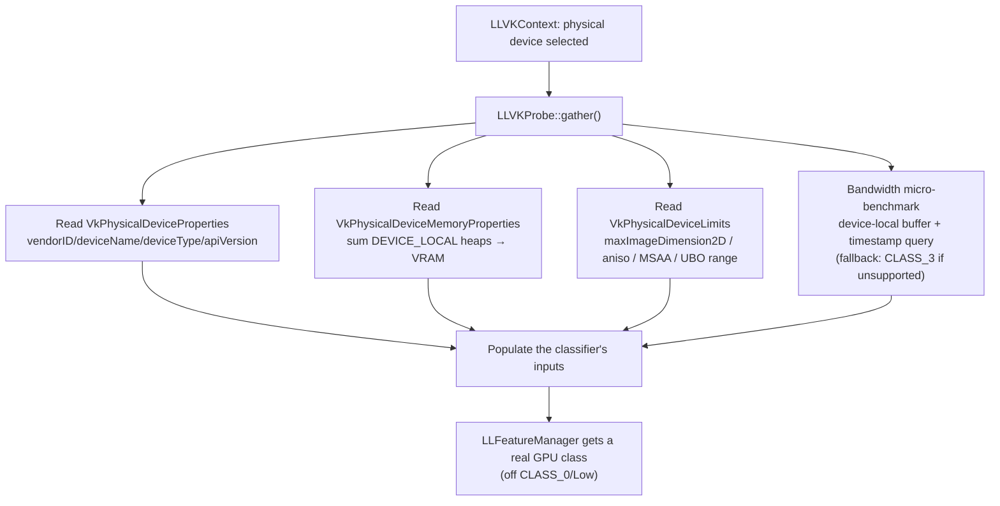

# Vulkan Capability Probe — Design

**Status:** DRAFT for review.
**Branch:** `vulkan-capability-probe` (from master baseline @ `8d0e03293d`).
**Scope:** get the Vulkan backend off GPU_CLASS_0 / Low by supplying the GPU
facts the feature classifier needs — **without an OpenGL context.** Not on the
UI critical path, but critical for the viewer to run *well* once the 3D pipeline
lands (feature/GPU-class selection drives shaders, shadows, draw distance,
texture memory budget).

---

## 0. The problem (agent-traced, 2026-09-02)

GPU classification (`GPU_CLASS_0..5`) is driven by `LLFeatureManager::
loadGPUClass()` ([llfeaturemanager.cpp:440](../../../indra/newview/llfeaturemanager.cpp)),
which reads `gGLManager` fields and runs a GL memory-bandwidth benchmark
(`gpu_benchmark()`, [llglsandbox.cpp:1046](../../../indra/newview/llglsandbox.cpp)).
On the Vulkan path there is **no GL context**, so `gGLManager` is never
initialized: the benchmark can't run, all GL fields are zero → the classifier
falls through to `GPU_CLASS_0` (Low) forever.

**Timing constraint:** `LLFeatureManager::getInstance()` first fires at
[llviewerwindow.cpp:2139](../../../indra/newview/llviewerwindow.cpp) during window
init, **before** `LLVKSession::start()` ([llappviewer.cpp:3851](../../../indra/newview/llappviewer.cpp)).
So a Vulkan probe cannot simply run "after the session starts" — either it runs
earlier, or the classification result is supplied/overridden after the fact.

---

## 1. What the classifier actually consumes → Vulkan equivalents

Most inputs map cleanly onto `VkPhysicalDevice*` structs (already available once
`LLVKContext` selects a physical device). One input has **no** Vulkan source.

| Classification input | GL source | Vulkan source | Clean? |
|---|---|---|---|
| Vendor (AMD/NVIDIA/Intel/Apple) | `mGLVendor` string | `VkPhysicalDeviceProperties.vendorID` (0x1002/0x10de/0x8086/0x106b…) | ✓ |
| Device name | `mGLRenderer` | `deviceName` | ✓ |
| Device type (discrete/iGPU) | — | `deviceType` (prefer DISCRETE) | ✓ |
| Max texture size | `GL_MAX_TEXTURE_SIZE` | `limits.maxImageDimension2D` | ✓ |
| VRAM (MB) | vendor mem extensions | `memoryProperties` DEVICE_LOCAL heaps sum | ✓ |
| MSAA samples | `GL_MAX_SAMPLES` | `limits.framebufferColorSampleCounts` (popcount) | ✓ |
| Anisotropy | `GL_MAX_TEXTURE_MAX_ANISOTROPY` | `limits.maxSamplerAnisotropy` | ✓ |
| Apple cap (CLASS_3) | `mIsApple` | `vendorID == 0x106b` | ✓ |
| System RAM <8GB down-step | `LLMemory` | unchanged (platform API) | ✓ |
| **Memory bandwidth (GB/s)** | `gpu_benchmark()` — GL render+texture loop + ARB_timer_query | **NONE** in `VkPhysicalDevice*` | ✗ |
| **GPU-class thresholds** | bandwidth + CPU bias → CLASS_0..5 | needs bandwidth | ✗ |

**The single blocker is memory bandwidth.** Everything else is a field read.

---

## 2. Bandwidth: the decision that shapes the probe

The GL benchmark times a texture-fetch loop with `ARB_timer_query`. There is no
`VkPhysicalDevice` field for it — it must be *measured* or *estimated*. Options:

- **A — Vulkan-native micro-benchmark (preferred).** A tiny, self-contained
  Vulkan pass that mirrors the GL benchmark's *result* (GB/s), not its GL logic:
  a large device-local buffer, a simple copy/shader read loop, timed with
  `VkQueryPool` (`VK_QUERY_TYPE_TIMESTAMP`) or calibrated host timing around a
  fence. Runs once, off the UI path, on the probe's own command buffer. This is
  the only option that produces a *real* number for high-end cards (RX 9070 XT
  → CLASS_5), and it's Vulkan-native (policy-clean). Needs a device + queue +
  a small buffer + timestamp query support (`limits.timestampComputeAndGraphics`
  / `timestampPeriod`).
- **B — Heuristic table.** vendorID + deviceType + deviceName → assumed class
  (discrete modern GPU → CLASS_4/5). Cheap, no GPU work, but it's a guess that
  will mis-rate edge cases and needs maintenance.
- **C — Static fallback (CLASS_3).** Safest, but permanently mis-rates high-end
  hardware — defeats the purpose.

**Recommendation: A, with C as the failure fallback.** Measure bandwidth with a
Vulkan-native timestamped micro-benchmark; if timestamp queries are unsupported
or the benchmark fails to run, fall back to CLASS_3 (never CLASS_0). B is a
maintainability trap; avoid.

---

## 3. Probe design

New, self-contained — `indra/llvulkan/llvkprobe.{h,cpp}` (extends the existing
`LLVKProbe` concept from Phase 1) + a bandwidth micro-benchmark. **Policy-clean:
no `gGL`, no GL context.** It reads `VkPhysicalDevice*` and runs its own tiny
Vulkan workload.

**Two sub-problems to solve in implementation:**

1. **Where the facts land.** The classifier reads `gGLManager` fields. The probe
   must supply those facts **without** `gGLManager.initGL()` (which needs a GL
   context). Two honest routes — decide in implementation:
   - *(a)* Populate the specific `gGLManager` *fields* the classifier reads
     (vendor/renderer/VRAM/max-texture) from the Vulkan probe — a narrow,
     field-level fill, not a GL init. Pragmatic, but touches the GL struct.
   - *(b)* Add a backend-abstracted "GPU facts" provider that
     `LLFeatureManager` reads, with a GL provider (unchanged behavior) and a
     Vulkan provider (the probe). Cleaner separation, but touches
     `LLFeatureManager`'s input path.
   **Lean (b)** for policy cleanliness — `LLFeatureManager` reads a
   backend-neutral facts struct; GL fills it from `gGLManager` (unchanged
   result), Vulkan fills it from the probe. Keeps the Vulkan path from poking
   the GL manager at all.

2. **Timing — beat the first read.** `LLFeatureManager` first reads during
   window init ([llviewerwindow.cpp:2139]), before the session. Options:
   - *(i)* Run the probe during `LLVKContext` physical-device selection (which
     happens before window init completes on the Vulkan path) and cache the
     facts, so the first `LLFeatureManager` read already sees them.
   - *(ii)* Defer/override classification: let it default, then re-classify once
     the probe has run (a `LLFeatureManager::setGPUClass` backdoor or re-entry).
   **Lean (i)** — populate before the first read — because it avoids a
   re-classification path and any settings written from the wrong class. Confirm
   the exact ordering during implementation (the device must exist before
   [llviewerwindow.cpp:2139] fires).

---

## 4. Acceptance

1. On the Vulkan path, the viewer logs a real GPU class (not CLASS_0/Low) and
   the corresponding feature tier (shaders/shadows/draw-distance/texture budget)
   appropriate to the hardware (RX 9070 XT → high class).
2. Facts logged match the physical device (vendor, deviceName, VRAM, max texture
   size) — verifiable against the Vulkan device log.
3. Bandwidth benchmark produces a plausible GB/s on supported hardware; on
   timestamp-unsupported/failed runs it falls back to CLASS_3 (never CLASS_0).
4. The GL path is **unchanged** (its facts still come from `gGLManager`; the
   classification result for GL is byte-identical to before).
5. No GL context is created on the Vulkan path; clean shutdown.
6. **About panel (Help → About)** shows the real Vulkan device on the Vulkan
   path — rendering API = Vulkan, backend/provider, device name, and VRAM —
   instead of blank/null (today `glGetString` returns null with no GL context).
   On the GL path it is unchanged.

## 4b. About panel (DECIDED 2026-09-02 — adopt, option A: folded into this branch)

Adopt the GHI viewer's Help→About renderer display. The GHI made
`LLAppViewer::getViewerInfo()` read the backend-neutral facts snapshot when
present (vendor/name/VRAM/api/backend/provider) and fall back to
`glGetString`/`gGLManager` otherwise, plus an About string (`AboutRenderer` in
`strings.xml`) showing Rendering API / Backend / Provider. The About floater
renders `getViewerInfo()`, so it surfaces automatically.

This is the **consumer-facing proof** that the probe's facts provider works
end-to-end: it reuses the SAME backend-neutral facts struct the probe populates
(decision b), so it is nearly free once the provider exists, and it validates
the provider without a second change. Folded into THIS branch (option A) so the
probe is self-validating. Precedent: archived GHI commit f67d53f63f.

## 5. Explicitly out of scope

The UI/render pipeline (separate `vulkanui` effort); 3D rendering; actually
*consuming* the GPU class for Vulkan render features (that comes with the 3D
pipeline). This branch gets the classification *correct* and surfaces it in
About.

## 6. Decisions & open questions

1. **Facts landing — DECIDED (2026-09-02): (b), backend-neutral GPU-facts
   provider** read by `LLFeatureManager`. The Vulkan path does NOT poke
   `gGLManager` fields. **This shape is a proven precedent in our own archive**:
   the GHI effort (`H:\VulkanStorm`, `vulkanstorm-ghi`) built exactly this — a
   backend-neutral `RendererIdentity`/`RendererSnapshot`
   (`llrender/ghi/include/llghirendererinfo.h`) published once after device
   creation and consumed by `LLFeatureManager` (`getRenderBackend`,
   `getRenderGPUIdentity`, `getRenderDisplayName`). We adapt that *shape*; the
   GHI's per-frame submission mistakes do not apply here (this is device-info,
   read once — not per-frame drawing).

2. **"PCI probe" — RESOLVED (2026-09-02): no separate PCI bus probe is needed.**
   The vendor/device IDs come from the **Vulkan API itself**:
   `vkGetPhysicalDeviceProperties` returns `vendorID` + `deviceID` (the same
   numeric PCI IDs, reported by the driver) plus `deviceName`, and
   `vkGetPhysicalDeviceMemoryProperties` returns the DEVICE_LOCAL heap sizes.
   The archived GHI Vulkan backend did exactly this (its identity string was
   `vendorID:deviceID:pipelineCacheUUID`). Reading IDs "from the hardware" IS
   reading them via the Vulkan API — a literal PCI/SetupAPI/`/sys/bus/pci`/IOKit
   enumeration would add three platform-specific subsystems for information the
   driver already hands us. Avoid it.

3. **Timing — DECIDED (2026-09-02): (b) bounded-defer.** The class NUMBER cannot
   be resolved until bandwidth runs at device-up, so on the Vulkan path we
   **withhold the class-dependent feature application until the class is
   known** — not "run it on a wrong class and fix later."

   **Why (b) over (a)/(c) — the persistence trap (subagent-verified):**
   `LLFeatureManager` first reads during the `LLViewerWindow` constructor, and
   `applyRecommendedSettings()` fires immediately at
   [llviewerwindow.cpp:2144](../../../indra/newview/llviewerwindow.cpp) →
   `applyFeatures()` writes **100+ render settings to `gSavedSettings`**. With no
   GL context the class is CLASS_0, so it stamps *low-end everything* (no
   deferred/SSAO/shadows/reflections/cube-maps, 64m draw distance, "Low"
   quality), and [llstartup.cpp:832](../../../indra/newview/llstartup.cpp)
   persists `LastGPUString`/`LastFeatureVersion`. On next launch the re-probe is
   skipped if the strings match → **wrong-low settings persist forever.**
   - (a) let-it-be-CLASS_0: persists broken-low. Rejected.
   - (c) CLASS_1 floor: persists *wrong*-low (less broken, still wrong) — the
     trap is that `applyRecommendedSettings` runs at all before the class is
     known, not which wrong value it uses. Rejected.
   - **(b) defer the settings application on the Vulkan path until the class is
     resolved at device-up.** Only option that keeps GL byte-identical AND never
     persists a wrong class.

   **The mechanism (bounded):**
   - **Static facts** still populate early in `LLVKProbe` (About panel, caps,
     VRAM, limits) — they are NOT class-dependent and are unaffected.
   - On the Vulkan path, the class is **"pending"** at first read; the
     `applyRecommendedSettings()` / feature-mask application is **withheld** (not
     run on CLASS_0).
   - **Resolve at device-up:** `LLVKSession::start()` runs the bandwidth
     benchmark → real class → run `applyBaseMasks()` + `applyRecommendedSettings()`
     ONCE with the correct class, before the 3D pipeline and before settings
     persist.
   - **The one in-gap consumer:** `isFeatureAvailable("WatchdogDisabled")` at
     [llappviewer.cpp:3864](../../../indra/newview/llappviewer.cpp) reads the
     masked list ~13 lines BEFORE `LLVKSession::start()`. When the class is
     pending it gets an explicit safe default (the watchdog decision is a debug
     feature that does not depend on GPU tier). Handled explicitly.

   GL path: byte-identical (no defer, runs exactly as today).
4. **Bandwidth — DECIDED (2026-09-02): (A) Vulkan-native timestamped
   micro-benchmark, with (C) CLASS_3 fallback.** This is effectively the only
   route to a real number: Vulkan has no `VkPhysicalDevice` bandwidth field
   (bandwidth is measured, not reported) and the existing benchmark is
   GL-specific (render loop + `ARB_timer_query`). The heuristic table (B) is
   rejected — it mis-rates high-end hardware (e.g. RX 9070 XT) and is a
   maintenance trap. The micro-benchmark mirrors the GL benchmark's *result*
   (GB/s), not its GL logic: a device-local buffer + a simple copy/shader read
   loop, timed with `VkQueryPool` (`VK_QUERY_TYPE_TIMESTAMP`, gated on
   `limits.timestampComputeAndGraphics` / `timestampPeriod`), run once off the UI
   path on the probe's own command buffer. If timestamp queries are unsupported
   or the benchmark fails, fall back to CLASS_3 (never CLASS_0).
