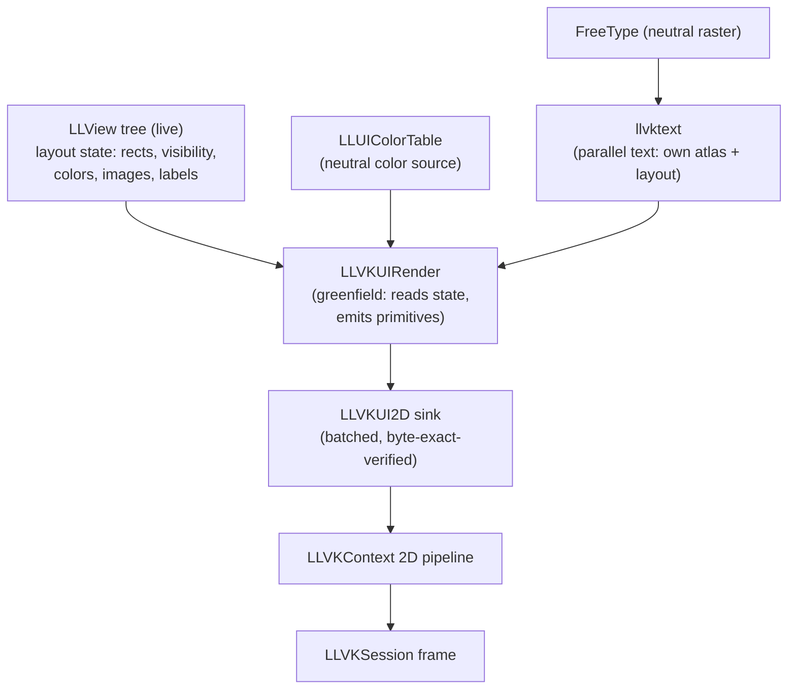

# Phase 3 v2 — M0 Design: Greenfield Vulkan UI renderer (state-reading)

**Status:** REVISED 2026-09-02 — supersedes the earlier router/funnel M0 design.
**Branch:** `vulkanui`. **Parent plan:** [phase3_v2_ui_plan.md](phase3_v2_ui_plan.md).
**Text contract:** [llvktext_design.md](llvktext_design.md).

---

## 0. The pivot (user decision, 2026-09-02)

The viewer's UI is **deeply fused with OpenGL** — `LLFontGL` fuses layout with GL
texture allocation; `LLViewerWindow::draw()` interleaves `gGL` with traversal;
textures are a GL manager. There is no clean seam to "route," and intercepting or
gating GL calls inside the tree is the contamination pattern the policy forbids
(proven twice: the 2026-08-31 init crash, and the reverted LLFontAtlasSurface
abstraction-layer attempt).

So M0 is **greenfield plus cheat-sheet** (user directive): a Vulkan-native UI
renderer that produces the *result* the GL UI produces, reading the same
*inputs* but executing **none** of GL's draw code. The cheat sheet is the
documented result contracts (the four UI contracts + the text contract).

**Variant (a) (user-chosen):** read the live `LLView` tree's **layout state**
(each widget's computed rect / visibility / colors / images / label) and render
it Vulkan-native. We reuse the layout *data* (the tree's reshape/arrange result)
but never call the GL-coupled `draw()` methods. This is greenfield rendering
driven by readable state — not a fork of the draw logic, and not an interception
of it.

**Superseded:** the `llui2drouter` + funnel-gating approach (running
`LLViewerWindow::draw()` and redirecting its GL calls). It kept hitting GL calls
embedded in the tree (the `gUIProgram.bind` crash, the font-atlas crash) precisely
because the tree *is* GL code. The harvested `LLVKUI2D` sink + 2D pipeline are
kept (they are the policy-clean GPU-submission core); the router/funnel layer on
top is replaced by the state-reading renderer.

---

## 1. The architecture

- **`LLVKUIRender`** — the greenfield renderer. Per frame: begin the 2D frame,
  walk the `LLView` tree in painter's order (reverse child list), read each
  widget's state via its public getters, and emit the equivalent primitives
  (solid/gradient rects, borders, images, drop shadows, text) to the sink. It
  never calls `draw()` on the Vulkan path and never reads `gGL`.
- **`llvktext`** — the parallel text renderer (see llvktext_design.md): FreeType
  raster → own Option-A atlas → glyph quads into the sink. Used exclusively by
  the Vulkan path.
- The GL path is **untouched** — it runs the tree's `draw()` as always (the
  byte-exact reference we diff against).

---

## 2. The readable render-state contract (agent-verified)

**Draw() is pure-output** (reads state, emits GL, never mutates layout) across
LLView/LLPanel/LLButton/LLLineEditor — so reading state without drawing is safe
and leaves the tree consistent.

**Geometry (computable without draw()):** `getRect()` (local), `calcScreenRect()`
(absolute, walks parent chain), `getVisible()`, `isInVisibleChain()`,
`getEnabled()`. Painter's order = reverse child list (`rbegin()`→`rend()`), so
iterate **back-to-front**.

**Per-widget visual state (public getters):**
- **LLPanel/LLFloater:** `isBackgroundVisible/Opaque`, `getBackgroundColor`/
  `getTransparentColor`, `getBackgroundImage`/`Overlay`, `hasBorder`/`getBorder`
  (LLViewBorder: `getBorderWidth/getBevel/getStyle/getHighlightLight/
  getShadowDark`), `getLabel`, `getCurrentTitle`, `isMinimized/isShown`.
- **LLButton:** `getCurrentLabel`/`getLabelUnselected/Selected`, `getFont`,
  `getToggleState`, `getHAlign`, `getFlashing`, the image set
  (`mImageUnselected/Selected/Hover*/Disabled*/Pressed*/Flash`, `getImageOverlay`),
  label colors.
- **LLTextBox/LLTextBase:** `getText()`, `getFont()`, LLStyle `getColor()/
  getReadOnlyColor()/getSelectedColor()/getShadowType()/getAlpha()`.
- **LLLineEditor:** `getText()`, `getCursor()`, `getSelectionRange()`, `getFont()`,
  fg/cursor colors, bg images.
- **LLCheckBoxCtrl/LLComboBox:** `get()`/`getValue()`, `getLabel()`,
  `getSelectedItemLabel()`, colors.

**Colors:** `LLUIColorTable::instance().getColor(name)` — neutral, no GL.
**Opacity:** `LLUICtrl::getCurrentTransparency()` + the draw-context alpha —
readable without drawing.

**Caveat to handle in implementation:** any widget whose appearance is computed
*only* inside draw() (not stored in readable state) must be re-derived; the agent
found none for the standard login chrome, but we verify per widget as we cover it.

---

## 3. M0 scope

Render the **login screen** chrome + text from readable state:
- Panel/floater backgrounds (solid + gradient + 9-slice images), borders,
  drop shadows.
- Buttons (image + label), line editors, checkboxes, combo boxes, text boxes,
  labels.
- Text via llvktext (FreeType raster + own atlas + sink).

The 3D world overlay (tool draw, HUD/mouselook) is NOT 2D UI and is out of scope
for the Vulkan UI pass. Media (login_html) is M4.

**Accept:** the login screen byte-exact vs GL (opaque tol 0, alpha tol 1) via the
capture harness; no GL context; clean shutdown; harness scenes 0–4 stay
byte-exact; non-binding benchmark recorded.

---

## 4. What carries over vs. what's replaced

| Kept (policy-clean) | Replaced |
|---|---|
| `LLVKUI2D` sink + `LLVKContext` 2D pipeline (byte-exact-verified GPU submission) | The `llui2drouter` + funnel gating (running GL draw() and redirecting) |
| FreeType rasterization (neutral) | GL font classes (LLFontGL/LLFontBitmapCache/LLImageGL) |
| The capture/diff harness + byte-exact baselines | The sink's GL-funnel call sites |
| `llvkrender` transform/scissor/batch math | `llvkrender` as a router backend (becomes the greenfield emit path) |

`llvkrender`'s batched-submission core is reused as `LLVKUIRender`'s emit engine;
its "router backend" role is dropped.
