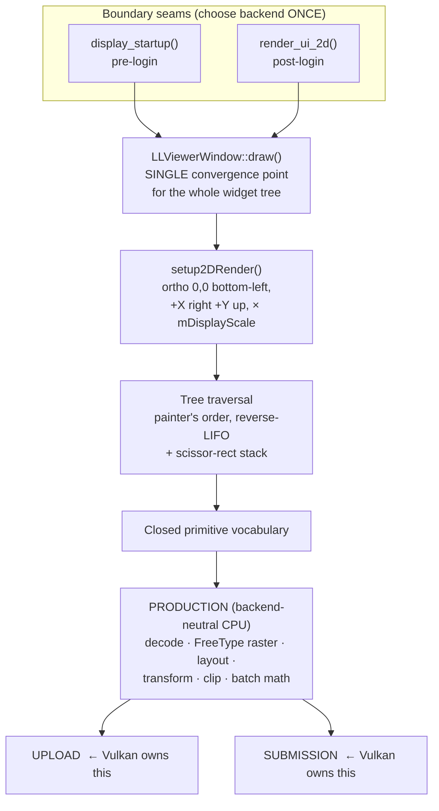
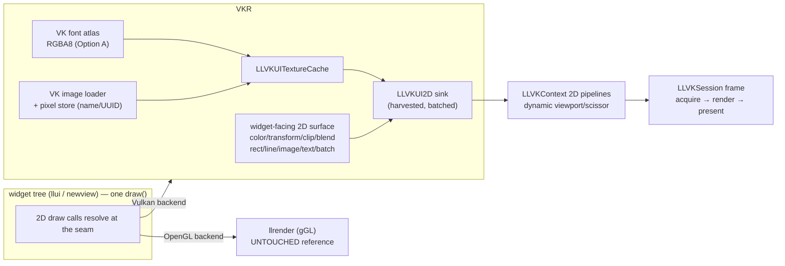

# Phase 3 (v2) — Independent Vulkan UI Pipeline

**Status:** DRAFT for review — no code written against this plan yet.
**Branch:** `vulkanui` (cut from master @ `8d0e03293d`, the PR #17 merge).
**Supersedes:** the `vulkan-ui` funnel/interception Phase 3 (draft PR #18, closed unmerged, retained as archive).

---

## 0. Governing rule

> **Follow the results, not the logic.**

GL's UI pipeline is the **reference for results only**. We reproduce the pixels it
delivers, with our own functions, contexts, and workflows. We do **not** enter
GL-coupled functions and skip the GL calls inside them; we do **not** reuse
GL-presuming machinery (`gTextureList`, `LLViewerFetchedTexture` GL upload,
`LLImageGL`, `LLGLState`, `gGL` submission, discard levels, `mTexName`). If a
function's body presumes a GL context, it is off-limits — not "call with guards."

The only GL touchpoints in the entire UI result are **texture upload** and
**draw submission**. Everything upstream of those two (decode, FreeType raster,
layout, transform, clip computation, batching math) is backend-neutral CPU work
that we may reuse. The plan below builds a Vulkan pipeline that owns exactly
those two touchpoints and reproduces every result contract the UI depends on.

This plan is written to be **two-executable-ready**: even while the runtime
`RenderBackend` selector exists, the Vulkan code path is written as if the GL
UI internals did not exist. Backend divergence is resolved at **boundary seams**
(choose GL path *or* Vulkan path once), never via guards inside GL machinery.

---

## 1. The holistic UI process

The UI is one interconnected process. The GL implementation routes every UI
pixel through a single funnel; understanding that funnel is what lets us replace
the *submission* end without disturbing the *production* end.

**Two frame entry points funnel into one tree draw:**
- Pre-login: [`display_startup()`](../../indra/newview/llviewerdisplay.cpp#L164) → `setup2DRender()` → `gViewerWindow->draw()`.
- Post-login: [`render_ui_2d()`](../../indra/newview/llviewerdisplay.cpp#L1949) → `setup2DRender()` → `gViewerWindow->draw()` (direct) *or* the `RenderUIBuffer` dirty-rect FBO path.

**Seam strategy:** at both entry points, when the Vulkan session owns the frame,
we run the *same* `LLViewerWindow::draw()` production traversal, but the
backend-neutral primitives it emits are submitted to the Vulkan sink instead of
GL. This is one boundary decision per frame, not per-call interception.

---

## 2. Result contracts (agent-verified)

Each contract below is what the rest of the system **consumes** — the pixels and
semantics — stated independently of GL. These are the acceptance specs.

### 2.1 Frame orchestration
- **Transform:** widget-space pixel `(x,y)` at a widget whose accumulated tree
  offset is `(Σ ancestors.mLeft, Σ ancestors.mBottom)` lands at logical pixel
  `(ΣmLeft + x, ΣmBottom + y)`, then scaled by `mDisplayScale` (aspect-correction
  × `LLUI::getScaleFactor()`), then ortho `[0,w]×[0,h] → [-1,1]`. Origin
  bottom-left, +X right, +Y up.
- **Order:** strict painter's algorithm — children traversed in reverse
  (`rbegin()→rend()`), so last-added draws last = on top. No depth buffer.
- **Clip:** pure screen-space rectangle **intersection** stack
  (`LLScreenClipRect`); nested clips only get more restrictive; empty stack = no
  clip. Scissor rect in GL bottom-left coords, `w+1,h+1`.
- **Dirty-rect FBO (`RenderUIBuffer`):** **pure performance optimization, default
  OFF, result identical to a full redraw.** → *Decision: Vulkan does a full clean
  redraw each frame; we do not port `mUIScreen`, the dirty-union, or the FBO
  blit. (Revisit only if fill-rate becomes a measured bottleneck.)*
- **Inputs read:** `LLUI::getScaleFactor()`, `LLFontGL::sCurOrigin`, camera
  zoom/sub-region, HUD zoom, `gFocusMgr.getTopCtrl()`, debug flags, skin colors.
  These are cosmetic/optimization inputs; none change ordering or geometry.
- **State persisted:** `sDirtyRect`/`sIsRectDirty` (only meaningful to the FBO
  path we are not porting); `sCurOrigin` reset per frame. Nothing the Vulkan path
  must carry frame-to-frame for correctness.

### 2.2 Images / textures
- **Per-draw hand-off:** destination rect `(x,y,w,h)` screen px + UV sub-rect
  `LLRectf` ∈ [0,1] + straight-alpha tint RGBA + blend mode + clip. Pixel result:
  `frag = tint × sample(uv)` blended over framebuffer. Shader multiply, **no
  premultiply**.
- **Blend:** `BT_ALPHA` (`SRC_ALPHA, ONE_MINUS_SRC_ALPHA`) ~always; glow uses
  `BT_ADD_WITH_ALPHA` (`SRC_ALPHA, ONE`).
- **Content-vs-pad:** GL pads NPOT images to power-of-2 and compensates with
  `mClipRegion = original_dim / padded_dim`. **Vulkan has no NPOT restriction →
  upload at exact content dims, UVs 0..1, the warp-bug class disappears.** The
  widget's *content rect* semantics are preserved as a result; the padded-texture
  logic is not.
- **9-slice:** `mScaleRegion` (normalized content space) splits into 9 quads (54
  verts): fixed-size corners, axis-stretched edges, center scales both axes.
- **Decode format:** RGBA8, **linear** (never sRGB), straight alpha, byte order
  RGBA. Source PNG/TGA/J2C.
- **Placeholder:** widget checks `imagep.notNull()`; if the image isn't loaded it
  simply **does not draw** (no explicit placeholder texture). Critical art is
  preloaded; dynamic art appears on the next draw after load.
- **Load key (pre-GL):** image **name** (string) or **UUID** — both known at
  widget construction, before any texture exists. Cache is keyed by name/UUID.

### 2.3 Text / fonts
- **Per-glyph result:** a screen-aligned quad (6 verts) at
  `origin + advance + bearing`, UV sub-rect into a glyph atlas page, colored by
  `tint × glyphAlpha`, `BT_ALPHA` blend. Pixel-snapped (`ll_round`).
- **Atlas:** packed 512×512 pages, 1px border, per-glyph
  `(offsetX, offsetY, w, h, bearing, advance)`. Grayscale glyphs = luminance+alpha
  (coverage in A); color emoji = BGRA premultiplied. Y-flip on copy into atlas.
- **Coordinate model:** baseline origin; `sCurOrigin` global offset; advance
  accumulates per glyph with kerning, rounded to whole px; vertical align
  (BASELINE/TOP/BOTTOM/VCENTER), horizontal align (LEFT/RIGHT/HCENTER).
- **Layout features actually used:** LTR only, word-wrap, ellipsis truncation,
  per-segment color (not mid-word), underline drawn as a separate line primitive,
  bold = double-draw at +1px, drop shadow = 1–5 offset copies. No RTL, no
  ligature shaping, no sub/superscript.
- **Backend-neutral:** FreeType rasterization is 100% CPU (FT_RENDER_MODE_NORMAL),
  no GL. Identical bitmaps under any backend. We reuse FreeType; we own the atlas
  texture (Vulkan) and the quad submission.

### 2.4 Chrome / primitives
**Exhaustive closed vocabulary** the sink must cover, all screen-space 2D,
pre-transformed CPU-side, per-vertex RGBA, straight-alpha blend:
solid/gradient rect · outline rect (1px) · line (1px) · triangle ·
textured quad (simple 6v, rotated, 9-slice 54v) · segmented 9-slice rect ·
drop shadow (10 tris, per-vertex alpha gradient, extends `lines` px right/down,
inner=start_color→outer=alpha 0) · checkerboard (tiled texture) ·
circle/arc/washer (rare, TRIANGLE_FAN/STRIP) · corner brackets · glyph quad.
- **Layering:** painter's order only; modals sit atop via a separate stack that
  still resolves to draw order. Opacity via `getCurrentTransparency()` modulating
  all primitives (`color % alpha`).
- **Blend:** only `BT_ALPHA` and `BT_ADD_WITH_ALPHA` are used. **No stencil, no
  XOR, no multiplicative, no depth, no custom shaders.** Rounded corners come
  from 9-slice texture art, not SDF/geometry shaders. → *Every effect maps to a
  standard Vulkan alpha-blend pipeline.*

---

## 3. Architecture — what we build

**DECIDED (2026-09-02): fully-parallel `llvkrender`.** We do NOT introduce a
single shared interface that both backends implement. Instead we build a
**Vulkan-native 2D render layer — `llvkrender` — that is the counterpart of
`llrender`'s 2D/UI role**, and we bind the Vulkan UI to it. The GL UI keeps
binding to `llrender` (untouched reference). Two parallel renderers, selected at
the backend seam, never sharing code — the purest reading of "results, not
logic" and the two-executable end-state. This supersedes the earlier single-sink
/ shared-interface framing.

**Three binding constraints keep fully-parallel honest:**
1. **`llvkrender` never includes or links `llrender`** — no `gGL`, no `LLRender`,
   no `LLImageGL`, no `LLVertexBuffer`. Physical module boundary + no include
   path. The two share only the **documented result contracts** (§2), never
   code. (This is the hard rule that prevents decay into wrapping GL.)
2. **`llvkrender` is scoped to the 2D/UI subset the tree actually uses** — the
   4 choke points (rect/line, image, text, scissor) plus a generic
   pre-transformed tri-batch for the ~5 custom-draw widgets (llstatbar graphs,
   llfloater cone, lltextbase selection, lllineeditor IME, llview debug). It is
   NOT a re-implementation of `llrender`'s 3D/world surface.
3. **Its submission core is the harvested `LLVKUI2D` sink** (batched, satisfies
   the §5b submission-granularity invariant). `llvkrender` is the widget-facing
   surface + production state; the sink is the GPU-submission engine beneath it.

**Binding seam:** the tree's 2D calls today are static (`gGL.foo()`,
`gl_rect_2d(...)`). The seam is a backend-conditional dispatch at the choke
points that resolves those calls to `llrender` (GL) or `llvkrender` (Vulkan),
chosen once per frame at `display_startup()` / `render_ui_2d()`. The Vulkan path
never reads `gGL` — its production state (transform/color/clip) lives in
`llvkrender`, not in GL.

**Components (all Vulkan-owned unless noted):**
1. **`llvkrender` module** — *new.* The Vulkan-native 2D render layer the Vulkan
   UI binds to: the widget-facing surface (color/transform/clip/blend state +
   rect/line/image/text/batch primitives) and the production-state owner. Sits
   above the sink; owns no GL.
2. **`LLVKUI2D` sink** — *harvest from `vulkan-ui` archive*; the GPU-submission
   core. **Contract-fit VERIFIED (2026-09-02):** owns the two GL touchpoints
   (descriptor upload, 2D-pipeline submission), implements ordering / scissor /
   blend / transform byte-exactly, carries the M1 fixes (append-offset batching,
   pre-allocated buffer, deferred grow, per-topology pipelines). No GL coupling.
   **Reuse approved, gated on closing the 5 vocabulary gaps** (additive emitters
   on the existing flush machinery, no core redesign):
   - **9-slice textured quad** — `texturedQuad9Slice()` emitting the 9 sub-quads
     with per-region UVs (54 verts).
   - **Glyph path** — emit glyph quads via the existing textured path; the
     mask×tint result comes from the **Option-A atlas** (below), so no new sink
     primitive — only correct UVs + the white+alpha texture.
   - **Gradient rect** — per-vertex-color rect (2/4-corner) via `rawTris`.
   - **Rare prims** (circle/arc/washer/triangle/corner-brackets) — FAN/STRIP
     triangulated CPU-side into `rawTris`; outlines via `lineStrip`.
   - **Rotated textured quad** — caller bakes rotation into verts →
     `texturedBatchPreTransformed` (already present; confirm only).
   Two plumbing details to preserve at the seam: the **scissor Y-flip** (GL
   bottom-left clip rects → Vulkan top-left scissor under the negative-height
   viewport) and the **transform feed** — both previously lived in the archived
   funnel and now live in `llvkrender`, which owns the neutral production state
   (it must NOT read them from `gGL`).
3. **VK image loader + pixel store** — *new.* Fetch (curl/file) → decode
   (LLImage, backend-neutral) → RGBA8 at exact content dims → store keyed by
   name/UUID. No `gTextureList`, no `LLViewerFetchedTexture` GL path, no discard
   levels, no `mTexName`, no `onUIImageLoaded` GL callback.
4. **`LLVKUITextureCache`** — staging upload + descriptor per resolved texture
   (archive version exists; re-key by name/UUID, not opaque pointer).
5. **VK font atlas** — *new upload path around reused FreeType raster* (FreeType
   is backend-neutral CPU). **Option A (decided 2026-09-02):** grayscale glyph
   coverage → **RGBA8 (RGB=white, A=coverage)** at upload, so the existing
   tint×texture multiply yields `tint.rgb, tint.a × glyphAlpha` with **no second
   shader variant** — one byte-exact multiply path for images and text. Color
   emoji stay BGRA premultiplied. Own 512² pages + descriptor-per-page.
6. **Frame seams** — `display_startup()` / `render_ui_2d()` select the backend
   once per frame; the production traversal runs once and its 2D calls resolve to
   the chosen renderer. **Full redraw; no `mUIScreen` FBO.**

**Explicitly not built:** `mUIScreen` dirty-rect FBO; any reuse of GL texture
objects or GL state; any guard-inside-GL-function; any shared interface
implemented by both backends (fully-parallel instead); GL matrix stack on the
Vulkan path (transforms are CPU pre-transform — `llvkrender` consumes the
results, never `gGL`).

---

## 4. Milestones

Each milestone ends in a **byte-exact (or policy-tolerance) diff vs. GL** on the
capture harness, per the parity policy: opaque = tol 0, alpha-blended = tol 1.

- **M0 — Skeleton frame.** Vulkan session runs `LLViewerWindow::draw()` into the
  sink with the correct ortho/scale/clip; solid backgrounds only. *Accept:*
  solid-color regions byte-exact vs GL on the login screen.
  - **M0 runs the REAL `LLViewerWindow::draw()` tree from day one** (decided
    2026-09-02), not a synthetic proxy — it tests the actual result path.
    Textured and text primitives are stubbed to **safe no-ops behind the sink**
    until M2/M3 (they emit nothing rather than touching GL or crashing); solid
    fills, outlines, lines, and scissor are live. This exercises the true seam +
    ortho + clip before we invest in the loader/atlas.
  - M0 must carry the **scissor Y-flip** and the `setTransform` wiring that the
    archived funnel owned — the seam reproduces them, the sink does not.
- **M1 — Chrome primitives.** rect/line/outline/gradient/drop-shadow through the
  sink. *Accept:* login window chrome + focus rings byte-exact.
- **M2 — Images.** VK loader + store + cache live; named chrome art and
  UUID-addressed dialog art render. *Accept:* icon/panel/dialog regions
  byte-exact; no padding warp.
- **M3 — Text.** VK font atlas + glyph quads; wrapping/ellipsis/segments/
  underline/bold/shadow. *Accept:* all login text byte-exact (tol 1, alpha).
- **M4 — Media/dynamic.** login_html and other dynamic textures via the loader.
  *Accept:* media regions match GL.
- **M5 — Sweep & full-frame.** every widget class; ungated full-frame byte-exact
  diff vs GL across login + a post-login scene.
- **(Parallel) Capability probe** — Vulkan populates device/feature facts from
  `VkPhysicalDeviceProperties` + memory properties before `LLFeatureManager`
  first reads them; bandwidth benchmark gets a Vulkan replacement or static
  fallback. *(Separate task; not on the UI critical path.)*

---

## 5. Testing protocol (unchanged)

- Notify before launching a viewer; 75 s settle; close via `WM_CLOSE`; verify
  `Goodbye!` + exit 0; never kill a healthy run.
- Capture via the existing harness env toggles; diff via
  `fsutils/vulkan_frame_diff.py` (`--mode opaque|alpha`).
- Harness scenes must stay byte-exact as each milestone lands (regression gate).
- Do not overstate parity — verify shapes visually; diff PNGs can mislead on
  narrow sample regions.

---

## 5b. Performance guardrail — the GHI pitfall (BINDING invariant, NON-BINDING benchmark)

**Hard-won lesson (archive `H:\VulkanStorm`, branch `vulkanstorm-ghi`):** a prior
attempt routed the UI through a generic hardware interface (GHI) and FPS
collapsed 60→3. Diagnosis from the archived code: the GHI made the **unit of
GPU submission the individual widget draw** — per-batch pipeline lookup/creation
on a `{blend, colorWriteMask}` key, per-batch uniform-buffer `writeBuffer`
upload, per-batch scissor/render-pass management — so hundreds of UI elements
became hundreds of state changes + uploads per frame. (A per-pixel validation
digest in the qualification harness compounded it.) The abstraction was clean;
the submission granularity was fatal.

**BINDING architectural invariant (the guardrail that prevents repeating it):**

> **The unit of GPU submission is the coalesced state-run, not the widget.** A
> frame of UI yields a bounded number of draws — the count of distinct
> blend/texture/scissor/topology *runs* in painter order — independent of how
> many hundreds of primitives the widgets emit. The widget-facing interface may
> be immediate-style, but the backend MUST accumulate the whole frame's geometry
> into a frame-wide buffer and submit per state-run. **Forbidden in the frame
> path:** per-primitive pipeline creation, per-primitive buffer upload,
> per-primitive render-pass begin/end, per-primitive device/queue sync
> (`vkDeviceWaitIdle`/`vkQueueWaitIdle`), per-primitive validation/readback.

The harvested `LLVKUI2D` sink already satisfies this (single 1M-vert append
buffer, flush per state-run, 2 blend × 2 topology pipelines created once, one
ortho push-const per flush, one render pass per frame, no mid-pass sync). Any
future backend behind the neutral interface must satisfy it too.

**NON-BINDING benchmark (informational, not a gate):** raw FPS is
**environment-dependent and must not be a blocker** — the old project saw
hundreds of FPS on unthrottled native GL vs. 60–100 under Mesa+Zink for
identical code. So we do NOT gate on an absolute FPS number. Instead, each
milestone *records* (a) draw-call count per frame (must stay bounded and
independent of primitive count), (b) per-frame submission cost trend, and
(c) a raw FPS datapoint **annotated with the backend/environment** it was
measured under. A regression in (a)/(b) — draws scaling with widget count, or
per-frame submission cost climbing — is the real alarm and triggers
investigation; the raw FPS number is context, not a verdict.

---

## 6. What changed vs. the superseded plan

| Superseded (`vulkan-ui`, funnel) | This plan (`vulkanui`, independent) |
|---|---|
| Intercept GL call sites (funnel hooks) | One boundary seam per frame; production traversal emits to a Vulkan sink |
| Repair GL texture pipeline to run GL-free | Own VK loader/store/cache keyed by name/UUID |
| Guard GL calls inside shared functions | GL-presuming functions are off-limits, not guarded |
| Port GL's NPOT padding + clip UVs | Exact-dims upload; UVs 0..1 (warp class removed) |
| (implicit) port dirty-rect FBO | Full clean redraw (FBO is opt-in perf only, default off) |
| Discard levels / `mTexName` fakery | Absent — GL residency logic is not a result |
